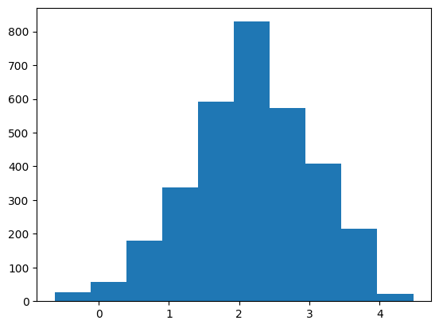
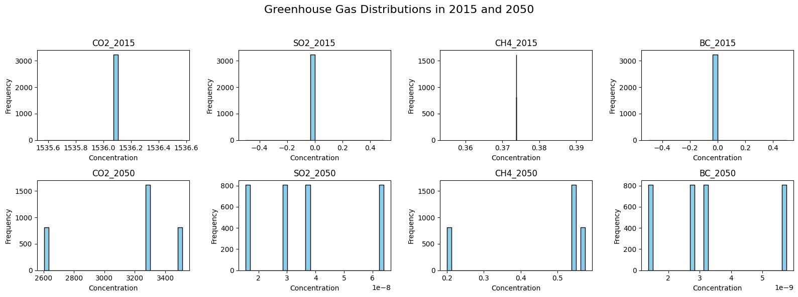

# Climate Model Emulator Using Random Forest

This project builds a machine learning emulator that approximates a complex climate model using tabular emissions and climate data. The goal is to predict **temperature anomalies in 2050** under various greenhouse gas emission scenarios, using lightweight models such as Random Forests.

---

## Project Objective

Climate simulators like NorESM2 are computationally expensive to run. This project uses historical and projected emissions data to train a Random Forest model that emulates the output of a full-scale simulator. The goal is to predict `tas_FINAL`, the **average temperature anomaly in 2050**, across spatial coordinates and Shared Socioeconomic Pathways (SSPs).

---

##  Dataset Overview

**Source:** [ClimateBench](https://github.com/duncanwp/ClimateBench)

Each sample includes:
- Spatial features: `latitude`, `longitude`
- Climate baselines from 2015 (e.g., temperature, precipitation)
- Annual global greenhouse gas emissions (2015–2050) for CO₂, CH₄, SO₂, N₂O
- **Target variable**: `tas_FINAL` → Temperature anomaly in °C relative to pre-industrial levels
- Scenario tag (e.g., `ssp126`, `ssp370`)—used only for evaluation, not training

---

## Data Exploration

### Temperature Anomaly Distribution

The target variable `tas_FINAL` represents the projected temperature anomaly in 2050. Most values are clustered around 2°C, with a tail extending above 4°C. This indicates mostly moderate emissions pathways with some extreme outliers.

---

### Greenhouse Gas Distributions: 2015 vs 2050

We visualized the distributions of key greenhouse gases in both the baseline (2015) and projection year (2050). Each gas showed distinct trends and ranges, highlighting variability in how emissions evolve across SSPs.

**Insights:**
- Features are on **vastly different scales** (e.g., ppm, ppb)
- Distribution shapes vary by gas and year
- Highlights the need for **feature standardization**

---

## Modeling and Evaluation

### Baseline Random Forest Model (Unscaled)

We trained a Random Forest model on unstandardized data.

**Performance:**
- **Train R²**: 0.9913
- **Test R²**: 0.9286

High training performance but visible drop on test data reflects **overfitting**.

---

### Feature Standardization

We applied **z-score normalization** to ensure equal feature contribution. After standardizing:

- **Test feature variance**: 0.976
- **Test feature mean**: ~0.018

**Standardized Model Performance:**
- **Train R²**: 0.9908
- **Test R²**: 0.9275

Standardization helped numerically but had minimal impact on performance, confirming that Random Forests handle raw scale well.

---

### Spatial Generalization (New Locations)

We tested the standardized model on a spatial test set:

- **Variance**: 1.004
- **Mean**: ~0.029
- **R² Score**: 0.5206

Significant drop in performance suggests the model struggles with **unseen geography** due to lack of spatial awareness.

---

### Scenario Generalization (New SSP)

Testing on SSP245 (a previously unseen scenario):

- **Variance**: 0.166
- **Mean**: ~-0.425
- **R² Score**: 0.3787

Even lower generalization on scenario shift. Indicates the model lacks **temporal and causal adaptability**.

---

## Standardization Recap

Standardization uses:

$$
z = \frac{x - \mu}{\sigma}
$$

Result:
- Features centered near 0
- Variance near 1

While beneficial for some algorithms, Random Forests proved resilient to scale. The real challenge remains **structural generalization**.

---

## Final Reflections

This project highlights the potential and limits of using classical ML models for climate emulation:

- High accuracy on in-distribution data
- ⚠Weak generalization across geography and scenarios
- Key takeaways:
  - Consider spatial encoding or grid-aware architectures
  - Explore temporal models (e.g., LSTMs, transformers)
  - Apply domain adaptation or hybrid physics-ML techniques

---
