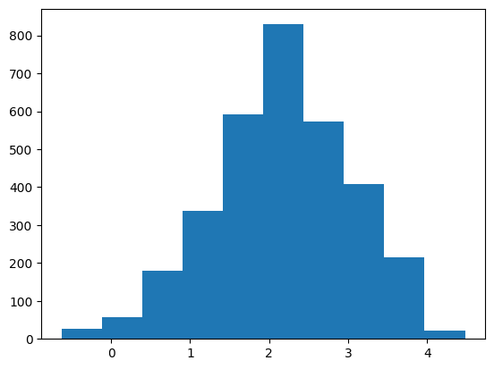
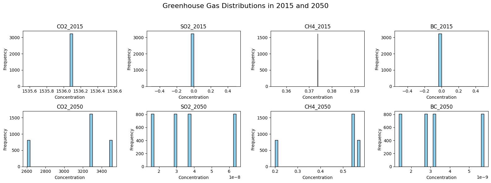

# Climate model emulation under distribution shift

An academic notebook using **Random Forest regression** to approximate a climate-model temperature output. The main question is how performance changes when evaluation moves beyond a random train/test split to new locations or an unseen emissions scenario.

## Main artifact

Open [Climate Model Emulator Using Random Forest.ipynb](Climate%20Model%20Emulator%20Using%20Random%20Forest.ipynb) for the code, assignment context, plots and saved outputs.

The data is derived from [ClimateBench](https://github.com/duncanwp/ClimateBench). Inputs include geographic coordinates, baseline climate variables and emissions features; the target is `tas_FINAL`.

## Recorded results

These values come from the notebook's saved outputs, not a new reproduction run.

| Evaluation | R-squared |
| --- | ---: |
| Random holdout, unscaled Random Forest | 0.9286 |
| Random holdout, standardized inputs | 0.9275 |
| Geographic holdout, standardized inputs | 0.5206 |
| Held-out SSP245 scenario, standardized inputs | 0.3787 |

The results illustrate a substantial generalization gap under geographic and scenario shift. Scaling had little effect on the random-holdout result in this experiment; the scores alone do not identify the cause of the distribution-shift failures.

## Reproduction requirements

The notebook expects these files in its working directory:

- `climatebench_train_val.csv`
- `climatebench_spatial_test.csv`
- `climatebench_scenario_test.csv`

These course-prepared CSV files are not included in this repository. Obtain the matching data and preprocessing specification before attempting to reproduce the recorded scores. The notebook uses pandas, NumPy, Matplotlib, SciPy and scikit-learn.

The current random split and Random Forest do not set fixed random seeds. Results may vary; a reproducible follow-up should save seeds, data versions and environment versions, and repeat the evaluation across several runs.

## Visual exploration

## Next steps

- Make the preprocessing and split definitions reproducible.
- Compare spatially held-out and scenario-held-out baselines.
- Analyze errors by geography and scenario rather than relying on one aggregate score.
