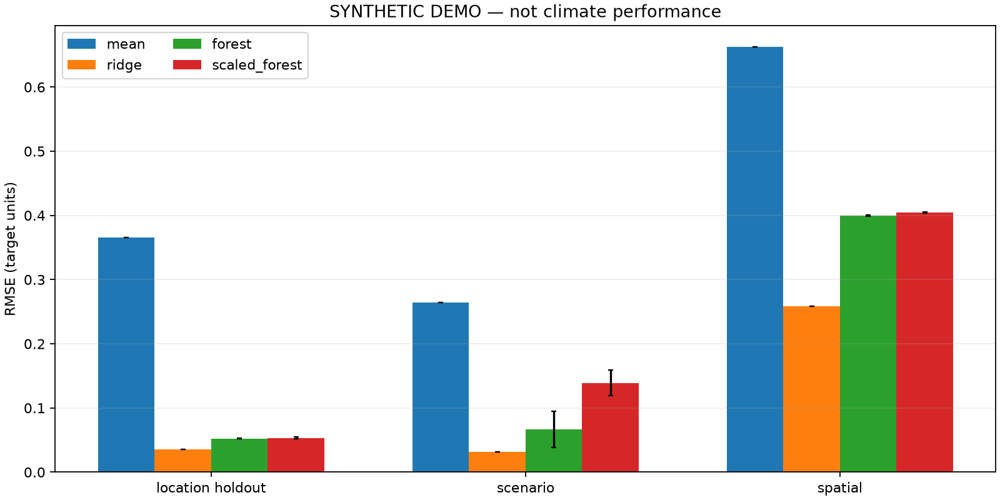
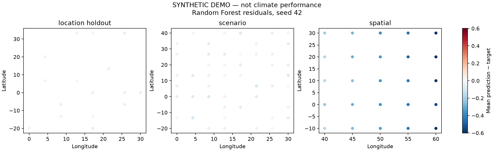

# SYNTHETIC DEMO — NOT CLIMATE PERFORMANCE

Internal split: `location`. Model selection used validation only.

| Model | Evaluation | Runs | R² (mean) | RMSE (mean) | RMSE (std) | MAE (mean) |
| --- | --- | ---: | ---: | ---: | ---: | ---: |
| forest | location_holdout | 3 | 0.9791 | 0.0522 | 0.0006 | 0.0420 |
| forest | scenario | 3 | 0.8285 | 0.0669 | 0.0283 | 0.0593 |
| forest | spatial | 3 | -0.1043 | 0.4001 | 0.0010 | 0.3741 |
| mean | location_holdout | 3 | -0.0216 | 0.3654 | 0.0000 | 0.3080 |
| mean | scenario | 3 | -1.3894 | 0.2640 | 0.0000 | 0.2208 |
| mean | spatial | 3 | -2.0285 | 0.6626 | 0.0000 | 0.5602 |
| ridge | location_holdout | 3 | 0.9902 | 0.0357 | 0.0000 | 0.0280 |
| ridge | scenario | 3 | 0.9655 | 0.0317 | 0.0000 | 0.0254 |
| ridge | spatial | 3 | 0.5392 | 0.2584 | 0.0000 | 0.2399 |
| scaled_forest | location_holdout | 3 | 0.9783 | 0.0532 | 0.0014 | 0.0427 |
| scaled_forest | scenario | 3 | 0.3278 | 0.1391 | 0.0200 | 0.1345 |
| scaled_forest | spatial | 3 | -0.1290 | 0.4045 | 0.0005 | 0.3787 |

Standard deviations describe training-seed variation on one fixed split; they are not confidence intervals.
Rows are weighted equally. These are not area-weighted global climate metrics.

Scenario-only evaluation retained 48 of 80 rows at training locations to avoid mixing spatial and scenario shifts.

Subgroup metrics by scenario and 15-degree latitude band are recorded in evaluation.json.
